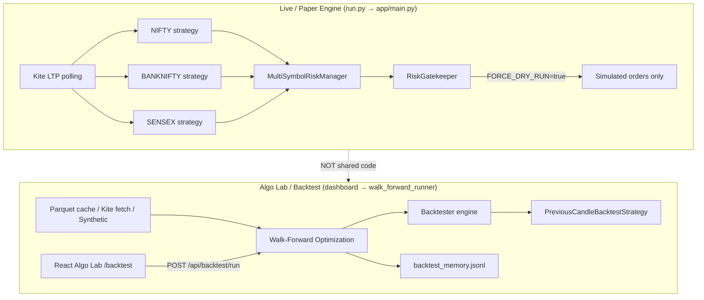

# Backtest vs Live Strategy — Full Audit & Action Plan

**Generated:** 2026-06-10 (Wednesday)  
**Last updated:** 2026-06-10 — Phases A–D + E1 implemented  
**Scope:** Codebase, API, logic, persistence  
**Status:** Backtest aligned with live exits; UI polished; jobs persisted; live path gated (E2/E3 optional)

---

## Executive Summary

| Question | Answer |
|----------|--------|
| **What does backtest achieve?** | Historical walk-forward research, regime learning, cost-aware simulation — not live trading. |
| **What do live strategies do?** | Run previous-candle breakout on NIFTY + BANKNIFTY + SENSEX in **paper mode** with rich risk/exit logic. |
| **Is backtest completely working?** | **Phase A fixed (2026-06-10).** Param search, PF/DD, daily reset, front-month filter, and trades_list pooling now work. Phase B parity with live strategy still pending. |
| **Do we need a database?** | **Not yet for current scale.** Results are stored on disk (JSONL + Parquet). Postgres/Redis in `docker-compose.yml` are **provisioned but unused** by application code. A DB becomes worthwhile when you need queryable history, multi-user access, or live run analytics at scale. |

---

## The Two Systems (Different Jobs)



| Dimension | **Backtest (Algo Lab)** | **Live Strategy (Paper Engine)** |
|-----------|-------------------------|----------------------------------|
| **Purpose** | Research: find robust params, measure OOS performance, learn by regime | Execution: run breakout logic on live/simulated prices every ~5–10s |
| **Symbols** | NIFTY futures only (single series) | NIFTY + BANKNIFTY + SENSEX (3 parallel strategies) |
| **Strategy class** | `backtesting/previous_candle_backtest_strategy.py` | `app/strategy.py` → `PreviousCandleBreakoutStrategy` |
| **Risk** | Inline sizing in backtest strategy | `MultiSymbolRiskManager` + `RiskGatekeeper` |
| **Orders** | Simulated in `Backtester` | Paper only — `FORCE_DRY_RUN` forced true; no real `kite.place_order` |
| **Data** | Historical 5m bars (cache/Kite/synthetic) | LTP poll + synthetic when market closed |
| **Output** | WFA folds, regime notes, `backtest_memory.jsonl` | Dashboard snapshots, trade ledger, diagnostics |

**Bottom line:** Backtest answers *“Would this idea have worked on history, with costs?”* Live strategy answers *“What should we do right now on 3 indices?”* They are related in philosophy (previous-candle breakout) but **not the same code path**.

---

## What Backtest Is Meant to Achieve

1. **Walk-forward optimization (WFA)** — Grid-search params on train folds, test out-of-sample (OOS).
2. **Regime breakdown** — Performance split by vol regime (low/normal/high).
3. **Realistic costs** — Zerodha-style brokerage, charges, slippage via `TransactionCostModel`.
4. **Learning memory** — Each run recorded to `backtest_memory.jsonl` with auto notes.
5. **Statistical checks** — Monte Carlo bootstrap, cost sensitivity (2x/3x), statistical power warnings.
6. **Data pipeline** — Kite fetch → parquet cache → health checks in UI.

**What it is NOT yet:** A trustworthy predictor of live paper performance, because of logic bugs and parity gaps (below).

---

## What the Live Strategy Does

`app/main.py` runs a **3-index paper engine**:

- One `PreviousCandleBreakoutStrategy` per symbol (NIFTY, BANKNIFTY, SENSEX).
- Polls LTP every 5–10s, rolls synthetic 5m candles, evaluates entries/exits.
- Routes orders through `multi_risk_manager` (per-symbol positions + global daily limits).
- Rich live features **not in backtest**: regime buffer, cooldown, trailing stop, breakeven, 90-min time exit, position health confidence, broker reconciliation, emergency halt.
- **Always paper** — `FORCE_DRY_RUN` is forced to `true` in `main.py`.

The React **Strategies** page (`/strategies`) shows live snapshots from `GET /api/status` and SSE stream.

---

## Is Backtest Completely Working?

### Plumbing: Yes (runs end-to-end)

| Layer | Status | Evidence |
|-------|--------|----------|
| API job queue | ✅ | `POST /api/backtest/run` → background job → `GET /api/backtest/result/{id}` |
| Cancel | ✅ | `POST /api/backtest/cancel/{id}` |
| Data fetch | ✅ | `POST /api/data/fetch`, `GET /api/data/health` |
| Frontend | ✅ | React Algo Lab at `/backtest` (Run, Results, Learnings, Fills, Data tabs) |
| WFA runner | ✅ | `walk_forward_runner.py` completes folds, writes memory |
| Real data cache | ✅ | Example: `NIFTY26JULFUT` parquet — 3522 rows, Apr 1–Jun 10 2026 |

### Research conclusions: No (not trustworthy yet)

#### Bug 1 — Param wipe when `research_mode=False`

In `backtesting/previous_candle_backtest_strategy.py`, when research mode is off, all grid-searched params are discarded and defaults are used:

```python
else:
    self.params = StrategyParams()
```

Verified: input `risk_per_trade_pct=0.004, breakout_atr_mult=0.65, research_mode=False` → result `0.0035, 0.85` (defaults).

Research mode **does** keep params (and relaxes filters).

#### Bug 2 — PF / drawdown always ~0 in WFA

`Backtester.run()` returns only `final_equity`, `total_return_pct`, `trades`, `equity_curve`. It never calls `calculate_metrics()`. WFA reads `profit_factor` and `max_drawdown_pct` that don't exist → defaults to 0.

#### Bug 3 — `reset_daily()` never called in backtest loop

`PreviousCandleBacktestStrategy.reset_daily()` exists but `Backtester.run()` never invokes it → `max_trades_per_day` only works on day 1.

#### Bug 4 — Mixed contracts in data

`data_loader.py` tags `front_month` and `rollover` but **does not filter** bars to front-month only → overlapping contract prices can contaminate signals.

#### Bug 5 — Default runs use synthetic data

Unless **“Use real data”** is enabled, the job falls back to 8000-bar synthetic series when cache has &lt;2000 rows.

#### Bug 6 — Top-level Monte Carlo / cost sensitivity often empty

Dashboard looks for `trades_list` per fold; WFA only stores trade **counts**, not lists → pooled MC and cost sensitivity often show “no detailed trades”.

---

## Module-by-Module Audit

### `app/` — Live Engine

| Module | Role | Health | Notes |
|--------|------|--------|-------|
| `main.py` | 3-index paper loop | ✅ Strong | Forces dry-run; daily reset; reconciliation |
| `strategy.py` | Live breakout logic | ✅ Good | Fixed pts + ATR trail + time exit + regime |
| `risk_gatekeeper.py` | Global risk limits | ✅ Strong | Tested in `test_risk_gatekeeper.py` |
| `multi_symbol_risk.py` | Per-symbol paper ledger | ✅ Good | 3-index positions; no live orders |
| `broker_reconciliation.py` | Broker sync | ✅ Good | Works; warnings ignored in paper |
| `market_calendar.py` | IST sessions, expiry | ✅ Good | `test_market_calendar.py` |
| `token_manager.py` / `kite_auth.py` | Auth | ✅ Good | Settings UI login flow |
| `emergency.py` | Halt API | ✅ Wired | `POST /api/emergency/halt` |
| `data_feed.py` | WebSocket | ⚠️ Optional | Disabled by default (Twisted/uvicorn conflict) |

### `backtesting/` — Research Engine

| Module | Role | Health | Notes |
|--------|------|--------|-------|
| `walk_forward_runner.py` | WFA orchestration | ⚠️ Partial | Runs; PF/DD wrong; MC per-fold OK |
| `backtester.py` | Bar-by-bar simulation | ⚠️ Partial | Costs/rollover OK; no metrics; no daily reset |
| `previous_candle_backtest_strategy.py` | Backtest signals | 🔴 Critical bug | Param wipe; simpler exits than live |
| `data_loader.py` | Kite multi-contract fetch | ✅ Fixed recently | Cache works; needs front-month filter |
| `data_health.py` | Parquet validation | ✅ Good | Staleness vs corrupt distinction |
| `metrics.py` | PF, DD, MC | ✅ Exists | Not wired into `Backtester.run()` |
| `costs.py` | Zerodha cost model | ✅ Good | Used correctly |
| `backtest_memory.py` | Learning store | ✅ Good | Records runs; insights API works |

### `web/dashboard.py` — API Hub

| Area | Health | Notes |
|------|--------|-------|
| Backtest jobs | ✅ | Progress, cancel, GPU detect |
| Data health/fetch | ✅ | Smart download with progress |
| Live status/SSE | ✅ | 3-index snapshots |
| Memory insights | ✅ | `/api/memory/insights` |
| Legacy HTML backtest | ⚠️ | Still at `:8050/backtest`; React is primary |

### `frontend/` — React UI

| Page | Health | Notes |
|------|--------|-------|
| `/backtest` (Algo Lab) | ✅ | Full tabs; job polling |
| `/strategies` | ✅ | Live 3-index cards |
| `/dashboard` | ✅ | Engine status stream |
| Build | ✅ | `npm run build` passes |

### `tests/`

Only 3 test files — calendar, risk gatekeeper, restart recovery. **No backtest integration tests.**

### Storage (see dedicated section below)

- OHLCV: `data/historical_cache/*.parquet` (not Postgres/Redis).
- Docker Postgres/Redis: optional; **not wired into Python code today**.

---

## Live vs Backtest Parity Gap

| Feature | Live (`app/strategy.py`) | Backtest |
|---------|--------------------------|----------|
| Exit logic | Fixed pts + ATR trail + breakeven + 90m time stop | ATR target/SL only |
| Regime filter | Full `get_market_regime()` + cooldown | Lightweight EMA trend only |
| Symbols | 3 indices | NIFTY only |
| Entry timing | Same-bar on LTP cross | Optional next-bar (good) |
| Risk gates | Gatekeeper blocks | Inline % risk only |
| Session filter | Calendar-aware | Similar but not identical |
| Daily trade cap reset | ✅ in main loop | ❌ not called in backtester |

Until parity improves, **do not promote backtest winners directly to paper params**.

---

## API Reference (Backtest & Data)

| Area | Endpoints |
|------|-----------|
| Backtest | `POST /api/backtest/run`, `GET /api/backtest/result/{id}`, `POST /api/backtest/cancel/{id}` |
| Data | `GET /api/data/health`, `POST /api/data/fetch`, `GET /api/data/cached_datasets` |
| Learning | `GET /api/memory/insights`, `GET /api/memory/report` |
| Live | `GET /api/status`, `SSE /api/status/stream`, `GET /api/trades`, `POST /api/emergency/halt` |

**Dev URLs:**
- Engine API: `http://localhost:8050`
- React Algo Lab: `http://localhost:5173/backtest` (Vite proxy to engine)

---

## Action Plan (Prioritized)

### Phase A — Make backtest trustworthy ✅ DONE (2026-06-10)

| # | Task | Status |
|---|------|--------|
| A1 | Fix param wipe in `previous_candle_backtest_strategy.py` | ✅ Done |
| A2 | Call `calculate_metrics()` inside `Backtester.run()` | ✅ Done |
| A3 | Call `strategy.reset_daily()` when bar date changes | ✅ Done |
| A4 | Filter `data_loader` output to `symbol == front_month` | ✅ Done |
| A5 | Store `trades_list` per WFA fold in results | ✅ Done |

Tests: `tests/test_backtest_engine.py` (8 cases, all passing)

### Phase B — Align research with live ✅ DONE (2026-06-10)

| # | Task | Status |
|---|------|--------|
| B1 | Shared module `app/breakout_core.py` for entry + exit rules | ✅ Done |
| B2 | Live exit stack (trail + time stop) in backtest `on_exit` | ✅ Done |
| B3 | API default `use_real_data=true`; synthetic/partial cache warnings | ✅ Done |
| B4 | Extended tests in `tests/test_backtest_engine.py` (10 cases) | ✅ Done |

### Phase C — Live readiness ✅ DONE (gated, 2026-06-10)

| # | Task | Status |
|---|------|--------|
| C1 | LIVE path: `FORCE_DRY_RUN=false` + `LIVE_TRADING_CONFIRMED=true` | ✅ Done |
| C2 | Multi-symbol live orders route through `RiskGatekeeper.place_guarded_order` | ✅ Done |
| C3 | BFO exchange for SENSEX via `RiskGatekeeper.resolve_exchange()` | ✅ Done |
| C4 | `multi_risk_manager.sync_with_broker()` in reconciliation | ✅ Done |

**Enable live (use with extreme caution):**
```powershell
$env:FORCE_DRY_RUN="false"
$env:LIVE_TRADING_CONFIRMED="true"
python run.py
```

### Phase D — UI polish ✅ DONE (2026-06-10)

| # | Task | Status |
|---|------|--------|
| D1 | Results tab: MC, cost sensitivity, GPU, data warnings | ✅ Done |
| D2 | React served from `:8050/ui/` after `npm run build` | ✅ Done |

### Phase E — Persistence upgrade

| # | Task | Status |
|---|------|--------|
| E1 | `data/backtest_jobs/*.json` + `GET /api/backtest/jobs` | ✅ Done |
| E2 | Postgres migration for JSONL stores | ⏳ Deferred |
| E3 | Redis job queue / SSE fan-out | ⏳ Deferred |

---

## Data Persistence — Do We Need a Database?

### Short answer

**You do not need a database right now** for the project to function. Strategy and backtest outcomes **are already stored** — on the filesystem under `data/`, using Parquet (market bars) and JSONL (events and run summaries). Postgres and Redis in `docker-compose.yml` are **infrastructure placeholders**; no Python module connects to them yet.

A database becomes worth adding when you need:
- SQL queries across thousands of runs (“best PF in high-vol regime last 6 months”)
- Multi-user / multi-machine access without file locking
- Durable job history after API server restarts
- Joining live trades, backtest runs, and Kite fills in one place

---

### Current persistence map

| What | Where | Format | Durable? | Used by |
|------|-------|--------|----------|---------|
| **Historical OHLCV** | `data/historical_cache/*.parquet` | Parquet | ✅ Yes (disk) | Backtest, data health, strategy warm-up |
| **Backtest run summaries** | `data/backtest_memory.jsonl` | JSONL (append-only) | ✅ Yes | WFA runner, `/api/memory/insights`, Learnings tab |
| **Live/paper signals & orders** | `data/trade_ledger.jsonl` | JSONL (append-only) | ✅ Yes | `strategy.py`, emergency halt |
| **Strategy restart state** | `data/strategy_state.json` | JSON | ✅ Yes | `state_persistence.py` (entry price, trail context) |
| **Audit / risk events** | `data/audit_events.json` | JSONL | ✅ Yes | `audit_logger.py` |
| **Diagnostic logs** | `logs/run_*.log` | Text | ✅ Yes | `diagnostic_logger.py` |
| **In-flight backtest jobs** | `BACKTEST_JOBS` dict in memory | RAM | ❌ Lost on restart | `web/dashboard.py` |
| **Live dashboard view** | SSE + in-memory snapshots | RAM | ❌ Ephemeral | `live_snapshots.py` |
| **Broker truth** | Kite API (`/trades`, `/orders`, `/positions`) | Remote | ✅ At broker | Reconciliation, Fills tab |

---

### How each flow stores results today

#### 1. Backtest / Algo Lab run

```
UI POST /api/backtest/run
  → job_id created in BACKTEST_JOBS (memory)
  → walk_forward_runner.run_walk_forward()
  → backtest_memory.record_run()  →  appends one line to data/backtest_memory.jsonl
  → full result dict also kept in BACKTEST_JOBS[job_id]["result"] until server restarts
```

- **Long-term learning:** `backtest_memory.jsonl` (params, folds, regime stats, auto-generated notes).
- **Short-term UI polling:** in-memory job dict only.
- **Gap:** If you restart `run.py` before exporting results, the detailed job payload is gone — but the memory line may still exist if the run completed.

#### 2. Live / paper strategy run

```
main.py loop every ~5–10s
  → strategy.run_once() per symbol
  → trade_ledger.record("signal.accepted" | "order.placed" | ...)
  → save_strategy_state() on position changes
  → live_snapshots.update_snapshot() for dashboard (memory only)
```

- **Long-term:** `trade_ledger.jsonl` (every signal, order, exit event).
- **Restart survival:** `strategy_state.json` for open-position context.
- **Gap:** No structured “daily P&L report” table — you derive it by scanning JSONL or Kite `/trades`.

#### 3. Market data download

```
POST /api/data/fetch
  → data_loader.fetch_real_nifty_futures_data()
  → writes data/historical_cache/SYMBOL_FROM_TO_5minute.parquet
```

- Parquet is the **database** for time-series bars — columnar, fast, no SQL server required.

---

### Postgres / Redis in docker-compose — status

| Service | Declared in | Used by app code? |
|---------|-------------|-------------------|
| Postgres 16 | `docker-compose.yml` | **No** — no `psycopg`, SQLAlchemy, or `DATABASE_URL` in repo |
| Redis 7 | `docker-compose.yml` | **No** — no `import redis` in repo |

`docker-compose.paper.yml` comments Postgres/Redis out entirely for simpler paper dev.

**Recommendation:** Use `docker-compose.paper.yml` for day-to-day dev unless you are actively building DB integration.

---

### Recommended persistence evolution

| Stage | Mechanism | When |
|-------|-----------|------|
| **Now (MVP)** | Parquet + JSONL on disk | Solo dev, &lt; few hundred backtest runs, single machine |
| **Next** | SQLite or Postgres for `runs`, `trades`, `jobs` tables | When you want SQL reports, job history survives restarts, or agent skills query history |
| **Later** | Postgres + Redis | Multi-worker API, job queue, real-time pub/sub for SSE |

`trade_ledger.py` and `backtest_memory.py` were **designed for this migration** — same `record()` / `record_run()` interfaces; swap the backend without changing strategy code.

---

### What to store when you add a DB (suggested schema sketch)

**`backtest_runs`**
- `run_id`, `timestamp`, `params_json`, `summary_json`, `research_mode`, `data_source` (real/synthetic)

**`backtest_folds`**
- `run_id`, `fold`, `best_params`, `test_return`, `profit_factor`, `max_dd`, `trades_count`

**`backtest_trades`**
- `run_id`, `fold`, `entry_time`, `exit_time`, `pnl`, `regime`, …

**`live_events`**
- Mirror of `trade_ledger.jsonl` rows with indexed `event_type`, `symbol`, `ts`

**`ohlcv`** — usually **keep as Parquet**; don’t load millions of bars into Postgres unless you need tick-level SQL.

---

## How to Run & Validate Today

**Live paper engine:**
```powershell
python run.py --dev
```

**Algo Lab (React):**
```powershell
cd frontend; npm run dev
```
→ `http://localhost:5173/backtest`

**For a meaningful backtest run:**
1. Data tab → confirm health **HEALTHY**
2. Run tab → enable **Use real data**; use **Research mode** until Bug 1 (A1) is fixed
3. Set folds ≥ 4, months ≥ 4
4. Treat PF/DD as unreliable until A2 is fixed; use return % and trade counts cautiously

---

## Document History

| Date | Change |
|------|--------|
| 2026-06-10 | Initial audit: backtest vs live, module audit, action plan, persistence analysis |
| 2026-06-10 | Phase A implemented: param preservation, metrics, daily reset, front-month filter, trades_list + tests |
| 2026-06-10 | Phases B–D + E1: breakout_core, live exits, job persistence, UI at /ui/, live trading gate |