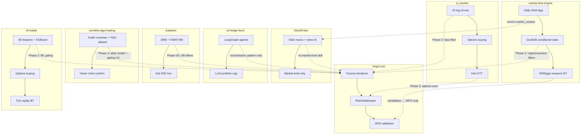

# Aegis — External Repos Reference

**Purpose**: Track adjacent open-source / co-founder trading repos worth revisiting when building Aegis. Not dependencies — reference material only.

**Last reviewed**: 2026-06-15 (added market-dna-engine)

---

## How to Use This Doc

| When | Look at |
|------|---------|
| Phase 1 — WebSocket + candle/OI builder | [oi_tracker](#1-oi_tracker-rajat157) `tick_hub`, `candle_builder` |
| Phase 2 — OI regime intelligence | [oi_tracker](#1-oi_tracker-rajat157) `analysis/tug_of_war.py` |
| Phase 2+ — ML gating, feature pipeline | [AI-trader](#2-ai-trader-aaryansinha16) `features/`, `models/`, scoring |
| Phase 2+ — Tick-precise backtest | [AI-trader](#2-ai-trader-aaryansinha16) `scripts/tick_replay_backtest.py` |
| Phase 3 — Options overlay execution | [oi_tracker](#1-oi_tracker-rajat157) `kite/order_executor.py` (GTT OCO) |
| Phase 2 — Morning market brief / macro context | [StockPulse](#3-stockpulse-pruthvikairepo) `market_ai.py`, `nse_data.py` |
| Phase 2 — News sentiment mining | [StockPulse](#3-stockpulse-pruthvikairepo) `classifier.py`, `scraper.py` |
| Phase 2 — Multi-agent orchestration patterns | [ai-hedge-fund](#4-ai-hedge-fund-virattt) `src/main.py`, `graph.py`, risk → portfolio flow |
| Phase 2 — Agent pipeline UX (dashboard) | [ai-hedge-fund](#4-ai-hedge-fund-virattt) React Flow visual graph builder |
| **Phase 0/1 — BANKNIFTY futures strategy** | [tradewin](#5-tradewin-hsatam) `strategy.py`, `entry_filters.py`, adaptive ORB/VWAP |
| Phase 0 — BankNifty historical data | [tradewin](#5-tradewin-hsatam) `nifty_bank_5min_15yr.csv` + download script |
| Phase 1 — Kite auth pattern | [tradewin](#5-tradewin-hsatam) `KiteClient.py` (compare with `app/kite_auth.py`) |
| Phase 2 — F&O instrument alias model (spot + FUT + CE chain) | [zerodha-algo-trading](#6-zerodha-algo-trading-anandaanv) `FUT1/FUT2`, `CE1/CE2/CE3` screener aliases |
| Phase 2 — Deterministic + Vision two-stage gating | [zerodha-algo-trading](#6-zerodha-algo-trading-anandaanv) Kotlin screener → chart PNG → OpenAI Vision |
| Phase 2 — Charting / Aegis UX | [zerodha-algo-trading](#6-zerodha-algo-trading-anandaanv) TradingView Lightweight Charts + multi-panel studies |
| Phase 1 — Kite OAuth admin / multi-user token mgmt | [zerodha-algo-trading](#6-zerodha-algo-trading-anandaanv) JWT + `/api/admin/kite-configs/` (compare with `app/kite_auth.py`) |
| Phase 2 — **Session DNA / conditional stats** (gap, PDH/PDL, ORB, DTE) | [market-dna-engine](#9-market-dna-engine-milesbusiness) `market_dna.py`, `RESEARCH_FINDINGS.md` |
| Phase 2 — Morning brief regime tags (VIX floor, open bias, expiry context) | [market-dna-engine](#9-market-dna-engine-milesbusiness) → enrich `app/market_context.py`, `fo-market-brief` skill |
| Phase 2 — ORB / gap-fill **candidate** strategies (research only) | [market-dna-engine](#9-market-dna-engine-milesbusiness) `backtest_app/engine.py` → `strategy_candidates.json` + WFO |
| Phase 2 — FO rules proposals from published edges | [market-dna-engine](#9-market-dna-engine-milesbusiness) → `fo-failure-pattern-miner` / `indian_fo_rules.json` proposals |

**Invariant**: Any code borrowed must route through `RiskGatekeeper`, pass WFA + cost model + statistical power gates, and never bypass reconciliation.

---

## 1. oi_tracker (rajat157)

| Field | Value |
|-------|-------|
| **URL** | https://github.com/rajat157/oi_tracker |
| **Focus** | NIFTY options — OI analysis + live trading |
| **Stack** | Python 3.11+, Flask + SocketIO, SQLite, Kite Connect |
| **Maturity** | ~223 commits; evolved well beyond README |

### What It Does

Real-time **Options Open Interest** dashboard and trading system for NIFTY:

- **Data**: Kite option chain + futures OI every ~3 min; WebSocket tick hub; live 1m/3m candles
- **Analysis**: "Tug-of-war" OI score (-100 to +100), IV skew, max pain, premium momentum, OI acceleration, regime detection
- **Strategy**: **Rally Rider** — regime-adaptive options buying (ITM CE/PE), mechanical signals + Claude agent confirmation
- **Execution**: `OrderExecutor` with paper/live toggle, GTT OCO (SL + target), trailing SL via GTT modify
- **Ops**: Telegram alerts, structured logging, EventBus, repository-pattern SQLite

Claimed backtest (from `CLAUDE.md`): ~60% WR, PF 1.90 over 300 days — **options intraday**, not futures breakout.

### Key Modules to Study

```
oi_tracker/
├── analysis/tug_of_war.py      # OI tug-of-war, futures OI confirmation filter
├── monitoring/tick_hub.py      # Single Kite WebSocket, dispatches ticks
├── monitoring/candle_builder.py
├── kite/order_executor.py      # GTT OCO, fill correction, trailing SL
├── kite/auth.py, instruments.py
├── strategies/rr_strategy.py   # Rally Rider (options buying)
└── strategies/rr_engine.py     # MC/MOM/VWAP signals + regime classification
```

### Relevance to Aegis

| Area | Relevance | Notes |
|------|-----------|-------|
| WebSocket + candles | **High** | Directly maps to Phase 1 `app/data_feed.py` target |
| OI regime intelligence | **High** | Candidate filter for futures breakout (bias veto, risk multiplier) |
| Options GTT execution | **High** | Phase 3 options overlay — wrap in RiskGatekeeper |
| Kite auth/instruments | **Medium** | Compare with `app/kite_auth.py`, `instruments_manager.py` |
| Rally Rider strategy | **Low** | Different edge; needs full WFA before any use |
| Claude subprocess agent | **Low** | Conflicts with Grok agentic workflow + human gates |
| Risk model | **Caution** | Lighter than RiskGatekeeper — do not adopt execution path as-is |

### Do Not Merge Now

Roadmap Phase 0 is futures-only. Treat as **options/OI R&D branch** complementary to our risk-first futures core.

---

## 2. AI-trader (aaryansinha16)

| Field | Value |
|-------|-------|
| **URL** | https://github.com/aaryansinha16/AI-trader |
| **Focus** | NIFTY intraday options — ML research + paper/live platform |
| **Stack** | Python 3.13, Flask API, Next.js 16 dashboard, TimescaleDB, XGBoost + Q-learning RL |
| **Data source** | **TrueData** (paid) — not Kite |
| **Maturity** | ~26 commits; polished full-stack research platform |

### What It Does

End-to-end **ML-driven intraday options** research system:

```
TrueData WebSocket → TickCollector → TimescaleDB
    → 80 macro + 5 micro features
    → XGBoost macro/micro/strategy models + RL exit agent
    → 3 rule-based strategies (VWAP breakout, bearish momentum, mean reversion)
    → Composite scoring → paper/live execution
    → Next.js terminal dashboard
```

| Layer | Detail |
|-------|--------|
| **Data** | NIFTY-I futures + ATM ±3 strikes (14 option contracts); 1-min candles; tick-level storage |
| **ML** | Macro model (P(bullish) in 15 min), micro model (tick momentum), per-strategy outcome models, RL exit agent (HOLD/EXIT/TIGHTEN) |
| **Scoring** | `0.5×ML_prob + 0.3×flow_score + 0.2×technical_strength + regime_bonus` |
| **Strategies** | VWAP momentum breakout (CALL), bearish momentum (PUT), mean reversion |
| **Risk** | LOW/MEDIUM/HIGH profiles; dynamic SL/target (ATR + score); trailing SL; Kelly-inspired sizing |
| **Backtest** | Tick-level replay on real option premium ticks — SL/target/trailing are tick-precise |

### Claimed Backtest Results (Mar–Apr 2026, ~15–18 days)

| Profile | Trades | Win Rate | Net P&L | Max DD |
|---------|--------|----------|---------|--------|
| MEDIUM | 49 | 71% | +₹53,715 | -₹5,411 |
| HIGH | 52 | 77% | +₹62,762 | -₹4,954 |
| LOW | 9 | 78% | +₹15,874 | -₹3,860 |

**Caveats**: Short sample window; strategy outcome models have AUC ~0.50 (too few samples); macro/micro retrain is documented as fragile; uses TrueData not Kite.

### Key Modules to Study

```
AI-trader/
├── scripts/tick_replay_backtest.py   # Tick-precise option premium replay
├── features/indicators.py            # 80 macro features (RSI, ATR, PCR, IV, session, etc.)
├── features/micro_features.py        # bid_ask_spread, order_imbalance, tick_momentum
├── models/train_model.py             # Walk-forward XGBoost trainers
├── models/rl_exit_agent.py           # Q-learning exit on premium trajectories
├── strategy/signal_generator.py      # Rule-based entry candidates
├── strategy/regime_detector.py       # TRENDING_BULL/BEAR/SIDEWAYS/HIGH_VOL/LOW_VOL
├── strategy/trade_scorer.py          # Composite ML + flow + technical score
├── data/tick_collector.py            # WebSocket tick buffer → DB
└── database/schema.sql               # TimescaleDB hypertables for ticks/candles
```

### Relevance to Aegis

| Area | Relevance | Notes |
|------|-----------|-------|
| Feature engineering pipeline | **High** | Many features overlap our regime/ATR work; adapt for Kite data |
| ML gating pattern (prob → veto/size) | **High** | Fits Phase 2 "Candle & Regime Intelligence" as gated multiplier |
| Walk-forward ML validation | **High** | Aligns with our WFA oracle — borrow methodology, not blind trust |
| RL exit agent (trade-relative state) | **Medium** | Interesting for options overlay exits; needs rigorous validation |
| Tick-level replay backtest | **Medium** | Superior to bar-approximated exits; heavy infra (TimescaleDB + ticks) |
| Regime detector + strategy gating | **Medium** | Similar concept to `get_market_regime()` — different features |
| Dashboard UX (trade journey charts) | **Medium** | Good ideas for Aegis dashboard |
| TrueData integration | **Low** | We standardize on Kite; patterns transferable, not the vendor |
| Broker execution / reconciliation | **Caution** | No RiskGatekeeper, no broker reconciliation — research-grade only |

### Documented Pitfalls (from their CLAUDE.md — worth remembering)

- Subscribing to NIFTY spot instead of NIFTY-I futures poisons all macro features
- Macro label threshold sensitivity (`0.001/15 bars` vs higher → collapsed outputs)
- Retraining macro/micro without stable baseline breaks RL exit behavior
- Continuation vs reversal strategies need different entry gates
- Trailing SL must check against **prior** SL within a bar, not ratcheted SL

---

## 3. StockPulse (PruthvikAIRepo)

| Field | Value |
|-------|-------|
| **URL** | https://github.com/PruthvikAIRepo/Automate-Stock-Trading |
| **Product name** | **StockPulse** (repo name is misleading — no automated trading) |
| **Focus** | Retail investor market intelligence dashboard for NSE/BSE **equities** |
| **Stack** | Python, Flask + SocketIO, SQLite (news), Angel One SmartAPI, OpenAI gpt-4.1-mini |
| **Maturity** | ~17 commits; early-stage; heavy dummy-data fallback for stocks/screener |

### What It Actually Does

**Not** an algo trading system despite the repo name. It is a **market research dashboard**:

```
Angel One SmartAPI (quotes + WebSocket) ──┐
NSE public JSON API (breadth, FII/DII, PE) ├── Flask dashboard (Jinja2 HTML)
RSS news scraper + OpenAI classifier ─────┘
    → Live index pages, sector rotation, AI market brief, news feed
```

| Layer | Detail |
|-------|--------|
| **Live data** | Angel One for NIFTY/BANKNIFTY/SENSEX + sectoral indices; WebSocket → SocketIO to browser |
| **Macro context** | NSE scrape: market breadth, FII/DII flows, Nifty PE/PB/DY, index constituents |
| **AI** | OpenAI structured outputs: daily market pulse, sector spotlight, risk check, investor action; news classification (8 categories + sentiment) |
| **Analytics** | Breadth divergence detection, sector rotation (1D vs 1W), pivot levels, SIP/lumpsum signals from PE+VIX+drawdown |
| **Equity features** | Screener, watchlist, sectors — mostly **dummy data**, not live |
| **Brokers** | Angel One (active); Dhan API v2 docs included (not wired in app code) |
| **Trading** | **None** — no orders, no backtest, no strategy loop, no position management |

### Key Modules to Study

```
Automate-Stock-Trading/
├── app/services/nse_data.py        # NSE session + breadth/FII-DII/PE/constituents scrape
├── app/services/market_ai.py       # Structured AI market brief (breadth divergence, VIX, FII/DII rules)
├── app/services/classifier.py      # Batch news classification via OpenAI structured outputs
├── app/services/indices_service.py # Multi-index quotes, sector TF returns, pivot levels
├── app/services/realtime.py        # Angel One WebSocket → SocketIO broadcast
├── app/services/scraper.py         # RSS news ingestion
├── app/services/scheduler.py       # Background news fetch + classify cycle
└── docs/DHAN_API_v2_COMPLETE_REFERENCE.md  # Dhan broker API reference (39KB)
```

### Relevance to Aegis

| Area | Relevance | Notes |
|------|-----------|-------|
| Morning market brief prompts | **High** | Directly feeds `fo-market-brief` skill vision — breadth divergence, VIX zones, FII/DII interpretation |
| NSE public API scraping | **Medium** | Free macro context without Kite quota; useful for pre-market regime context |
| Sector rotation detection | **Medium** | 1D vs 1W relative strength — could inform index selection (NIFTY vs BANKNIFTY) |
| News classification pipeline | **Medium** | Pattern for `fo-failure-pattern-miner` — structured categories + NSE symbol tagging |
| AI caching + cost control | **Medium** | 5-min cache, token logging — good ops pattern for agent skills |
| WebSocket → dashboard | **Low** | Angel One specific; we use KiteTicker |
| Equity screener/watchlist | **Low** | Out of scope (index F&O only per roadmap) |
| Dhan API docs | **Low** | Only if multi-broker expansion; we standardize on Kite |
| Algo trading / execution | **None** | Misleading repo name — zero trading infrastructure |

### Do Not Merge

No execution path exists. Borrow **prompt patterns** and **NSE data scraping** only — as read-only inputs to intelligence layer, never as trade signals without WFA validation.

---

## 4. ai-hedge-fund (virattt)

| Field | Value |
|-------|-------|
| **URL** | https://github.com/virattt/ai-hedge-fund |
| **Focus** | Educational **multi-agent LLM hedge fund** for US equities |
| **Stack** | Python + Poetry, **LangGraph**, FastAPI backend, React/Vite frontend (React Flow) |
| **Data source** | **Financial Datasets API** (paid US market data) — not Kite, not NSE |
| **Maturity** | ~849 commits, **~60k GitHub stars**; active (release v2026.6.9); MIT license |

### What It Does

Proof-of-concept where **19 LLM agents** collaborate to produce buy/sell/hold decisions on US stocks (e.g. AAPL, MSFT, NVDA). **Does not execute real trades.**

```
Financial Datasets API
    → Multiple analyst agents (Buffett, Burry, Taleb, Lynch, Jhunjhunwala, etc.)
    → Valuation / Sentiment / Fundamentals / Technicals agents
    → Risk Manager (vol + correlation-adjusted position limits)
    → Portfolio Manager (final JSON trade decisions)
    → CLI backtester (re-runs full agent graph per trading day)
```

| Layer | Detail |
|-------|--------|
| **Orchestration** | LangGraph `StateGraph` — parallel analyst nodes → risk → portfolio → END |
| **Persona agents** | 13 famous-investor LLM personas with distinct prompts (includes Rakesh Jhunjhunwala, but on **US tickers**) |
| **Quant agents** | Rule-based valuation, sentiment, fundamentals, technicals (non-LLM signal generators) |
| **Risk manager** | Volatility-adjusted % limits + correlation multiplier between positions |
| **Portfolio manager** | LLM synthesizes all signals into JSON `{ticker: {action, quantity, confidence}}` |
| **Backtest** | `BacktestEngine` invokes full agent pipeline day-by-day (slow, non-deterministic, API-costly) |
| **Web app** | Visual **React Flow** graph builder — drag/connect agents, run flows, stream reasoning to UI |
| **LLM providers** | OpenAI, Anthropic, Groq, DeepSeek, Gemini, xAI (Grok), Moonshot, Azure, Ollama (local) |

### Key Modules to Study

```
ai-hedge-fund/
├── src/main.py                          # LangGraph workflow: analysts → risk → portfolio
├── src/agents/risk_manager.py           # Vol + correlation position limits (deterministic math)
├── src/agents/portfolio_manager.py      # LLM final decision synthesis
├── src/agents/*.py                      # Persona + quant analyst agents
├── src/backtesting/engine.py            # Day-by-day agent backtest wrapper
├── app/backend/services/graph.py        # Dynamic graph from React Flow UI
├── app/backend/services/backtest_service.py
└── app/frontend/src/components/Flow.tsx # Visual agent pipeline editor
```

### Relevance to Aegis

| Area | Relevance | Notes |
|------|-----------|-------|
| Multi-agent orchestration (LangGraph) | **Medium** | Pattern for Phase 2 agentic layer — but our agents propose filters, not place orders |
| Analyst → Risk → Portfolio pipeline | **Medium** | Mirrors our vision: intelligence proposes → RiskGatekeeper decides |
| Vol + correlation risk limits | **Medium** | `risk_manager.py` math could inspire `multi_symbol_risk.py` / gatekeeper augmentations |
| React Flow agent pipeline UI | **Medium** | Good UX reference for future "Agent Insights" dashboard tab |
| Persona-based agent prompts | **Low** | US equity fundamental investing ≠ Indian index futures intraday |
| Rakesh Jhunjhunwala agent | **Low** | Name only — no NSE data, no Indian F&O mechanics |
| LLM backtester (daily agent invoke) | **Low / Caution** | Non-deterministic, expensive, can't replace our WFA oracle |
| Financial Datasets API | **None** | US equities; no Indian index futures/options |
| Live broker execution | **None** | Explicitly educational only — no Kite, no reconciliation |

### Critical Mismatch With Our Philosophy

Our project is **deterministic + risk-first**. This repo is **LLM-opinion-first**:

- Agent outputs vary run-to-run → fails statistical power / reproducibility gates
- Risk manager is advisory input to another LLM, not a hard execution gate
- No broker reconciliation, no circuit breaker, no Indian F&O cost model

**Safe borrow**: orchestration topology, risk-limit *math* (not LLM decisions), dashboard UX for agent flows. **Never borrow**: LLM-as-trader decision loop without full WFA + human review.

---

## 5. tradewin (hsatam)

| Field | Value |
|-------|-------|
| **URL** | https://github.com/hsatam/tradewin |
| **Focus** | **BANKNIFTY futures** live + backtest on Zerodha Kite |
| **Stack** | Python, Kite Connect, PostgreSQL (trade logs), Telegram, YAML config |
| **Maturity** | ~100 commits; personal/production-style; 0 GitHub stars but substantial code |

### What It Does

The **most directly comparable** repo to Aegis — same broker, same asset class (index futures), intraday MIS.

```
Kite historical_data (5min) → indicators (ATR, EMA, RSI, VWAP)
    → Adaptive strategy picker (ORB vs VWAP_REV per day)
    → Entry filters (momentum, cooldown, same-zone reentry, pullback)
    → TradeExecutor (paper/live) → SLManager (ATR trailing)
    → PostgreSQL + CSV trade logs + Telegram
```

| Layer | Detail |
|-------|--------|
| **Strategies** | **ORB** — 9:15–9:30 range breakout with buffer; **VWAP_REV** — mean reversion off VWAP deviation |
| **Adaptive mode** | Morning range ATR > 15 → ORB; else VWAP_REV (configurable) |
| **Exits** | ATR-based SL/target; trailing SL after 2 min; near-target tighten; 15:25 EOD exit |
| **Filters** | 3-candle momentum confirm; weak candle skip; post-entry health check; same-zone reentry block (15 min, 0.5×ATR); pullback required before re-entry |
| **Risk** | `MAX_DAILY_LOSS`, cooldown minutes, post-14:30 entries only if ATR > 1.2× avg; adaptive lot sizing from capital |
| **Costs** | Built-in brokerage/STT/GST/SEBI/stamp in `_calculate_pnl()` |
| **Data** | Includes **`nifty_bank_5min_15yr.csv`** (~15 years 5-min BankNifty); `support_download_nifty_bank_15yr_index.py` |
| **Tuning** | `support_orb_tuner.py`, `support_vwap_tuner.py`, `orb_grid_results.csv` |
| **Live orders** | Kite MIS + SL-M (stop-loss market) — **not** through a separate gatekeeper layer |

### Key Modules to Study

```
tradewin/
├── strategy.py                    # ORB + VWAP_REV + adaptive picker + indicators
├── MarketData.py                  # Kite fetch, decide_trade_from_row + reentry filters
├── entry_filters.py               # Choppy market + post-entry health check
├── SLManager.py                   # ATR trailing, near-target aggressive tighten
├── trade_manager_refactored.py    # TradeExecutor: paper/live, costs, cooldown, monitor loop
├── backtester.py                  # Bar-by-bar BT sharing live TradeExecutor
├── KiteClient.py                  # Token file auth (compare with our kite_auth)
├── support_orb_tuner.py           # ORB parameter grid search
└── nifty_bank_5min_15yr.csv       # 15yr BankNifty 5-min dataset
```

### Relevance to Aegis

| Area | Relevance | Notes |
|------|-----------|-------|
| BANKNIFTY strategy logic | **Very High** | Closest peer — ORB/breakout family overlaps `PreviousCandleBreakoutStrategy` |
| Adaptive ORB vs VWAP switch | **High** | Regime-style daily strategy selection — candidate for `get_market_regime()` extension |
| Reentry filters (same-zone, pullback) | **High** | Retail anti-patterns we care about — encodable in strategy or gatekeeper |
| Post-entry momentum health check | **High** | Early exit on weak follow-through — similar to our breakeven/time exits |
| 15yr BankNifty CSV + download script | **High** | Immediate WFA fuel for Phase 0/1 BankNifty validation |
| ATR trailing SL patterns | **Medium** | Compare with `breakout_core.py` trailing logic |
| Indian F&O cost model in executor | **Medium** | Cross-check against `backtesting/costs.py` |
| ORB/VWAP grid tuners | **Medium** | Parameter research workflow — route through our WFA, not raw grid results |
| Kite token file auth | **Low** | We have `kite_auth.py` / auto-login — compare only |
| Risk / execution | **Caution** | No RiskGatekeeper, no broker reconciliation, SL-M placed directly |

### Overlap vs Our Project

| | tradewin | Aegis |
|--|----------|------------------|
| **Symbol** | BANKNIFTY only | NIFTY + BANKNIFTY + SENSEX (Phase 0) |
| **Strategy** | ORB + VWAP reversion (adaptive) | Previous-candle ATR breakout + regime |
| **Risk** | Daily loss + cooldown | RiskGatekeeper + reconciliation + circuit breaker |
| **Backtest** | Single CSV bar loop | WFA + MC + cost model + power gates |
| **Lot size** | 35 (legacy in BT) | Dynamic from `instruments_manager` (30 for BN 2026) |

**Highest-priority borrow** among all external repos for **Phase 0 BankNifty work**. Port filters and adaptive logic as **research candidates** — validate through our WFA before any live use.

---

## 6. zerodha-algo-trading (anandaanv)

| Field | Value |
|-------|-------|
| **URL** | https://github.com/anandaanv/zerodha-algo-trading |
| **Product name** | Charting + screening platform (repo name is misleading) |
| **Focus** | Cross-segment **screening** (equity spot + F&O + options) with AI chart validation |
| **Stack** | Java 21 + Kotlin, Spring Boot 3, Ta4j, MySQL, React/Vite, TradingView Lightweight Charts, OpenAI Vision, Selenium headless charts |
| **Maturity** | ~687 commits since 2019; 56 stars / 33 forks; active (pushed May 2026); 53 open issues; Docker + CI |

### What It Actually Does

**Not** a live algo trading loop despite the repo name and description. The current `README.md` is explicit:

> *"As of now, we are not looking at realtime algo trading… we are looking at a comprehensive screening mechanism."*

```
Kite Connect historical sync → MySQL
    → Kotlin screener DSL (.kts, hot-reload)
        (spot + FUT1/FUT2 + CE1/CE2/CE3 aliases, Ta4j indicators)
    → Pass → multi-panel TradingView charts + studies (Selenium render)
    → OpenAI Vision second filter (custom prompts)
    → Trades page (human executes later — no automated order loop)
```

| Layer | Detail |
|-------|--------|
| **Data** | Batch sync from Kite Connect into MySQL; cross-segment (spot, futures, options chain) |
| **Screeners** | Kotlin scripting engine — `sma().crossesOver()`, `entryIf`/`exitIf`, assignable F&O aliases |
| **F&O aliases** | `FUT1`, `FUT2` for futures rolls; `CE1`–`CE3`, `CE_1`–`CE_3` for ITM/OTM option strikes |
| **Charts** | Lightweight Charts + Elliott wave, Fibonacci, pattern studies; PNG export for Vision |
| **AI** | OpenAI Vision on rendered chart images — hybrid Kotlin + AI validation (not LLM-as-trader) |
| **Auth/Ops** | JWT, Google OAuth, admin Kite config endpoints, CloudFront/S3 deploy (see `CLAUDE.md`) |
| **Extras** | `strategies` git submodule → private repo; `ds-python/finrl-poc` FinRL POC; Dhan integration docs |
| **Roadmap** | Real-time WS execution, backtesting engine, portfolio risk — all **not built yet** |

`README.back.md` describes a more ambitious vision (live execution, backtest engine) — treat as aspirational, not current behavior.

### Key Modules to Study

```
zerodha-algo-trading/
├── screener/*.kts                          # Kotlin DSL screeners (SMA crossover example)
├── src/main/kotlin/com/dtech/algo/         # Spring Boot backend, screener engine, Kite sync
├── ui/chart-draw-app/                      # React chart drawing + screener config UI
├── docs/COMPLETE_IMPLEMENTATION_GUIDE.md   # Full platform architecture
├── docs/CHART_ANALYSIS_IMPLEMENTATION.md   # Vision pipeline
├── docs/ml-dtb-filter-results.md           # ML double-top/bottom filter experiments
├── docs/elliott_engine_lld_spec.md         # Elliott wave engine spec
└── ds-python/finrl-poc/                    # FinRL proof-of-concept (Python)
```

### Relevance to Aegis

| Area | Relevance | Notes |
|------|-----------|-------|
| F&O alias notation (FUT1, CE1 chain) | **High** | Clean pattern for cross-instrument screeners — compare with `instruments_manager.py` |
| Two-stage gating (code → Vision) | **Medium** | Interesting Phase 2 pattern: deterministic signal first, LLM as veto/confirm only |
| Kite historical sync + MySQL schema | **Medium** | Reference for batch candle/OI warehouse if we outgrow parquet cache |
| TradingView chart UX | **Medium** | Aegis dashboard — multi-timeframe panels, study overlays |
| Cross-segment screening (spot + fut + opt) | **Medium** | Phase 2+ regime intelligence; aligns with deferred options overlay |
| Elliott wave / pattern docs | **Low** | Heavy TA research; needs WFA before any gatekeeper use |
| FinRL POC | **Low** | Reinforcement learning ≠ our risk-first deterministic core |
| Kotlin/Java stack | **Low** | Different language — borrow **patterns**, not code |
| Live execution / RiskGatekeeper | **None** | Explicitly deferred; trades page is manual |
| OpenAI Vision as primary signal | **Caution** | Non-deterministic — only as human-in-loop or soft veto, never order authority |

### vs tradewin / oi_tracker

| | zerodha-algo-trading | tradewin | oi_tracker |
|--|----------------------|----------|------------|
| **Primary use** | Screen + chart + AI confirm | **BN futures live** | NIFTY options live |
| **Instrument scope** | Broad (equity + F&O) | BANKNIFTY futures only | NIFTY options |
| **Execution** | Manual (trades page) | Kite MIS automated | GTT OCO automated |
| **Stack** | Java/Kotlin + React | Python | Python |
| **Best for us** | Alias model, Vision gating UX | **Phase 0 BN strategy** | Phase 1 WS + OI |

**Medium relevance** — strongest on **instrument modeling** and **screening UX**, not on intraday futures execution. Revisit when building Phase 2 cross-segment intelligence or Aegis charting. Do **not** prioritize over tradewin for Phase 0.

---

## 7. stock-trading-Platform / TradeFlow (Harsh-Upadhyay005)

| Field | Value |
|-------|-------|
| **URL** | https://github.com/Harsh-Upadhyay005/stock-trading-Platform |
| **Product names** | **TradeFlow** (GitHub description) / **StockFlow** (README) — inconsistent branding |
| **Focus** | Aspirational **Kite-like brokerage simulator** (equities, generic global exchanges) |
| **Stack (claimed)** | Next.js 16, Prisma 7, PostgreSQL, TimescaleDB, Redis, BullMQ, Socket.io, Clerk |
| **Stack (actual)** | Next.js 16 default app + Clerk middleware + Prisma schema + empty stubs |
| **Maturity** | **15 commits** since Mar 2026; 1 star; last push Jun 2026 |

### Critical Finding: README ≠ Code

This repo has one of the largest **documentation–implementation gaps** among repos reviewed. The 18KB README describes a production-grade trading terminal; the codebase is essentially a **Next.js starter + AI-generated Prisma schema**.

| README claims | Actually in repo |
|---------------|------------------|
| TradingView Lightweight Charts, live order book | **None** — default `create-next-app` homepage |
| Socket.io real-time, Redis, BullMQ workers | **None** in `package.json`; worker files are **empty** (0 bytes) |
| TimescaleDB hypertables, tick ingestion | **None** — no `database/sql/`, no Timescale setup |
| Order placement API, portfolio P&L, GTT OCO | **None** — `app/api/alerts/route.ts` and all validators/types/utils are **empty stubs** |
| Vitest + Playwright 80% coverage | **None** — no test scripts or test files |
| NextAuth.js v5 | **Clerk** (`@clerk/nextjs`) — README is wrong |
| `src/` monorepo with trade terminal pages | **`app/` only** — single `page.tsx` (Vercel template) |

**Non-empty application code** (excluding generated Prisma client): ~6 files, ~130 lines total (`page.tsx`, `layout.tsx`, `middleware.ts`, stub `actions.ts`).

```
Actual repo (Jun 2026):
  Next.js 16 + Clerk middleware
  → Default homepage ("edit page.tsx")
  → prisma/schema.prisma (~27 models, ~900 lines — schema only)
  → Empty: workers/, validators/, types/, utils/, API route handlers
  → No Kite, no NSE, no broker adapter, no market data feed
```

Commit history tells the story: Vite/React template (Mar 17) → migrated to Next.js (Mar) → massive README + Prisma schema dump (Jun 6–7) → empty scaffold files committed with feature-sounding commit messages.

### Prisma Schema (Only Substantive Artifact)

~27 models covering generic brokerage: `User` (Clerk-linked), `TradingAccount`, `Order` (OCO/bracket via `linkedOrderId`), `Position`, `OHLCV`, `OptionContract`, `RiskProfile`, `AuditLog`, etc.

Indian touches exist but are superficial:
- `currency` default `INR`, `ifscCode`, `timezone` default `Asia/Kolkata`
- `Exchange.code` comment mentions `NSE`/`BSE` alongside `NYSE`/`NASDAQ`
- `AssetClass` includes `FUTURE` and `OPTION` — **no index futures mechanics** (lot size rolls, MIS, STT breakdown, etc.)

No Kite Connect, no instrument master sync, no algo strategy loop, no reconciliation.

### Relevance to Aegis

| Area | Relevance | Notes |
|------|-----------|-------|
| Prisma schema as brokerage data model reference | **Low** | Generic; our Python/SQLite path is established — not worth a stack switch |
| Order OCO/bracket `linkedOrderId` pattern | **Low** | Concept only — oi_tracker has real GTT OCO code |
| `RiskProfile.maxDailyLoss` in DB | **Low** | We have `RiskGatekeeper` + `multi_symbol_risk.py` — richer and execution-bound |
| `AccountType.DEMO` paper trading | **Low** | We already have paper mode + `FORCE_DRY_RUN` |
| Trading terminal UX (charts, order form) | **None** | Not built |
| Indian index F&O / Kite integration | **None** | Zero broker or NSE code |
| Algo trading / backtest | **None** | Roadmap item in their own README |

### Verdict

**Do not prioritize.** Treat as a **portfolio/resume scaffold** — impressive README and schema, minimal runnable trading logic. The GitHub description ("simulated buy/sell orders, portfolios, charts") describes intent, not shipped software.

**Safe borrow (if ever needed)**: skim `prisma/schema.prisma` for generic order/ledger field naming when designing a future paper-trading ledger — but prefer learning from **oi_tracker** (real GTT) or our own `broker_reconciliation.py` patterns.

**Red flags for external repo evaluation**:
- Commit messages claim features; files are 0 bytes
- README references dependencies not in `package.json`
- Roadmap lists "paper trading mode" as future — contradicts "simulator" description

---

## 8. Python-for-Indian-Traders (SankarSrinivasan1)

| Field | Value |
|-------|-------|
| **URL** | https://github.com/SankarSrinivasan1/Python-for-Indian-Traders |
| **Product name** | **Trade Code NSE Python Lab** (part of "Trade Code Series") |
| **Focus** | Beginner educational Python lab for NSE equity traders |
| **Stack** | Python, pandas, Kite Connect, Streamlit, Jupyter (declared) |
| **Maturity** | ~24 commits since May 2026; 0 stars; MIT license; **66 KB total** |

### What It Actually Is

The README is **honest** about being educational and not production-ready — unlike StockFlow. But the folder tree over-promises: most modules are **2–6 line stubs**, not implementations.

```
README promises:          Actual code:
data/ NSE fetching    →   fetch_sample_data() with hardcoded RELIANCE/TCS/INFY prices
strategies/ (4)       →   4-line if/else stubs (e.g. breakout_signal)
backtest/             →   fake "backtest" = sum of close-to-close diffs
broker/ Kite          →   kite = KiteConnect(...); print("Kite initialized")
risk/                 →   check_daily_loss returns current_loss < max_loss
journal/ dashboard/   →   print() stubs
notebooks/ (3)        →   1-line placeholder text files, not real notebooks

Real code (~255 lines):
  Full Code/VWAP EMA.py  — RELIANCE equity, 5m Kite historical, VWAP+EMA20/50+volume signal, Telegram alert
  Full Code/WVAP.py      — simpler VWAP cross (filename typo), same RELIANCE hardcoded token
```

| Layer | Detail |
|-------|--------|
| **Instruments** | **RELIANCE equity only** (hardcoded `instrument_token=738561`) — no NIFTY/BANKNIFTY futures, no NFO |
| **Strategy** | VWAP + EMA trend + volume filter → BUY/SELL/HOLD; prints + optional Telegram — **no order placement** |
| **Data** | `kite.historical_data()` only; `nse_data_fetch.py` is dummy DataFrame |
| **Backtest** | Not a strategy backtest — accumulates bar-to-bar close deltas |
| **Risk** | One-liner daily loss check — no position sizing, no gatekeeper |
| **Broker** | Kite init + paper_trading_simulator stub — no reconciliation |
| **Trade forensics** | `track_mistake(note)` prints string — concept only, aligns with behavioral mining idea |
| **Dashboard** | `streamlit_app.py` stub — 3 lines |

### Key Files to Study (if any)

```
Python-for-Indian-Traders/
├── Full Code/VWAP EMA.py       # Only complete script — VWAP+EMA signal + Telegram
├── Full Code/WVAP.py           # VWAP cross variant
├── strategies/breakout_strategy.py  # 4-line teaching stub
├── broker/kite_connect_example.py   # KiteConnect init only
└── trade_forensics_lite/       # Behavioral tracking stubs (mistake, emotion tags)
```

### Relevance to Aegis

| Area | Relevance | Notes |
|------|-----------|-------|
| VWAP + EMA signal logic | **Low** | Concept overlaps tradewin `VWAP_REV` — borrow from **tradewin**, not this |
| Kite historical_data pattern | **Low** | We have `data_loader.py`, `kite_auth.py` — more complete |
| Trade forensics / mistake journal | **Low–Medium** | Idea fits `fo-failure-pattern-miner` skill — stubs only, no structured schema |
| Beginner folder layout | **Low** | Reasonable teaching structure; our project is past this stage |
| Index F&O / futures / MIS | **None** | Equity RELIANCE only |
| RiskGatekeeper / WFA / costs | **None** | Explicitly not production per README |
| Live execution / reconciliation | **None** | Signal print + Telegram only |

### vs tradewin

| | Python-for-Indian-Traders | tradewin |
|--|---------------------------|----------|
| **Asset** | RELIANCE equity | **BANKNIFTY futures** |
| **VWAP** | Signal print script | **VWAP_REV live strategy** with filters |
| **Code depth** | ~255 real lines + stubs | Full production-style loop |
| **Honesty** | README says educational ✓ | Personal live system |

**Lowest practical borrow priority** among Kite Python repos — useful only as a **beginner reference** for VWAP calculation syntax or as a **folder template** for a teaching fork. Our codebase is strictly ahead.

### Do Not Merge

No F&O mechanics, no validation oracle, no execution path. The `trade_forensics_lite` naming is interesting for future agent skills but contains no encodable logic yet.

---

## 9. market-dna-engine (milesbusiness)

| Field | Value |
|-------|-------|
| **URL** | https://github.com/milesbusiness/market-dna-engine |
| **Focus** | Statistical **Market DNA** for NIFTY 50 + Bank Nifty — conditional probabilities before indicators |
| **Stack** | Python, pandas, DuckDB, pyarrow, Flask backtest UI, yfinance gap-fill |
| **Data source** | Local parquet **TradeStore** (`E:\TradeStore`) — index minute bars, India VIX; **not in repo** |
| **Maturity** | ~3 commits (initial release 2026-06-14); MIT; strong README + `RESEARCH_FINDINGS.md` |

### What It Does

Research platform that tags every trading day (~35 fields) and stores queryable stats in DuckDB:

```
Local minute bars (index spot)
    → market_dna.py
        ├── build_daily_dna()       — gap type/size, fill/continuation
        ├── pdh_pdl_statistics()    — 5-stage institutional sweep detection
        ├── orb_statistics()        — 9:15–9:45 ORB direction + range buckets
        ├── session_statistics()    — half-hour green-rate bias
        ├── expiry_statistics()       — DTE-tagged range / gap-fill behavior
        ├── add_adx_regime()          — choppy / ranging / trending
        └── edge_scanner()            — exhaustive 2-condition combo search
    → market_dna.duckdb
    → backtest_app/ (ORB-30, gap-fill swing, monthly bias — points P&L UI)
```

Published findings (NIFTY 2015–2022, 1,965 days) — treat as **hypotheses**, not promotion gates:

| Edge | Stat | Caveat |
|------|------|--------|
| Gap up + PDH **not** swept early → gap fills | **71.7%** (n=53) | Small sample; index spot only |
| ORB shorts share of backtest profit | **88%** | Points, no Indian F&O costs |
| 9:15–9:30 session closes red | **55.4%** | Session filter, not standalone edge |
| Gap-fill mean reversion needs VIX > 13 | Low VIX fill ~13% | Aligns with our VIX zone logic |
| Near-expiry (DTE 0–3) avg range | +40–60% vs normal | Risk sizing / filter input |

ORB backtest (filtered, 609 trades): WR 51.6%, PF 1.20, +2,687 **pts** — no brokerage, slippage, or futures basis.

### Key Modules to Study

```
market-dna-engine/
├── market_dna.py              # DNA tagger + DuckDB + edge_scanner CLI
├── RESEARCH_FINDINGS.md       # Pre-computed conditional stats (2015–2022)
├── backtest_app/
│   ├── engine.py              # ORB-30 (8 filters), gap-fill, position bias
│   ├── server.py              # Flask API
│   └── static/index.html      # TradingView + trade reasoning UI
├── fetch_nifty_yfinance.py    # Index gap extension via yfinance
└── docs/                      # Architecture + dev guides (added 2026-06-14)
```

### Relevance to Aegis

| Area | Relevance | Notes |
|------|-----------|-------|
| Conditional session stats (gap/PDH/ORB/DTE) | **High** | Complements `app/market_context.py` — deeper intraday structure than VIX/FII alone |
| VIX floor for mean-reversion gates | **High** | "No gap-fill edge when VIX < 13" → morning brief + regime veto proposals |
| ORB short bias + Tuesday skip + ORB range filters | **Medium** | Overlaps tradewin ORB; use as **filter layer**, not replacement for breakout core |
| DuckDB daily-tag store | **Medium** | Offline research on `data/historical_cache` — query layer separate from Postgres |
| `backtest_app` trade reasoning UX | **Medium** | `entry_reason` / `lesson` per trade — pattern for Insights / journal enrichment |
| `edge_scanner` combo search | **Low–Medium** | Useful R&D; watch multiple-comparison bias — holdout required |
| Live execution / broker / risk | **None** | No Kite, RiskGatekeeper, reconciliation, or SEBI tagging |
| Futures roll + Zerodha cost model | **None** | Index spot minutes; must re-validate on NFO/BFO via `run_promotion_wfo.py` |

### vs Aegis `market_context.py`

| | market-dna-engine | Aegis today |
|--|-------------------|-------------|
| **Scope** | Historical conditional stats + offline tags | Live VIX, FII/DII, open-bias hints |
| **Intraday structure** | PDH/PDL sweeps, ORB buckets, session green rates | Partial (open bias only) |
| **Expiry context** | DTE-tagged range / gap-fill tables | Calendar-aware, not DNA-tagged |
| **Validation** | In-sample stats + point backtest | WFO @ 1x/2x costs on **futures** |
| **Live path** | None | Paper/live via RiskGatekeeper |

**Complementary, not competitive** — DNA answers *when* regimes favor certain behaviors; Aegis answers *whether our futures strategy survives costs*.

### Planned Integrations (borrow later — not implemented)

Priority order for a future sprint:

1. **`scripts/build_market_dna.py`** (new) — Read Aegis `data/historical_cache` parquet (not `E:\TradeStore`); emit daily DNA rows to `data/market_dna/` or DuckDB. Reuse tag logic concepts from `build_daily_dna()`, `pdh_pdl_statistics()`, `orb_statistics()` — port, do not vendor the hardcoded `STORE` path.

2. **`app/market_context.py` enrichment** — After 9:45 IST, attach runtime tags: `gap_bucket`, `pdh_swept`, `orb_range_pts`, `dte`, `vix_zone`. Feed `fo-market-brief` skill and `/ui/insights` regime cards. Fail gracefully (same invariant as VIX fetch).

3. **`indian_fo_rules.json` proposals** — Human-gated encodings, e.g.:
   - `vix_min_for_gap_fade: 13`
   - `orb_short_bias_on_wed_thu: true`
   - `suppress_mean_reversion_dte3_gap_down: true` (from DTE 3 gap-down fill suppression stat)
   - Route through `fo-failure-pattern-miner` — never auto-apply.

4. **Strategy candidates** — ORB-short-bias intraday or gap-fill-fade as entries in `data/strategy_candidates.json`; mandatory `run_promotion_wfo.py --cost-multiplier 2.0` on **rolled futures** before any paper enable.

5. **Insights / journal UX** — Borrow per-trade `entry_reason` / `lesson` pattern from `backtest_app/engine.py` for agent-generated session notes (display only).

### Do Not Merge Now

- Do **not** wire DNA conditional edges directly into live entries — index spot stats ≠ NFO futures after basis + 2× costs.
- Do **not** treat PF 1.20 / 71% fill headlines as promotion passes — small-n cells and data cutoff at **2022**.
- Do **not** adopt `edge_scanner` output without holdout / WFO — exhaustive 2-way combos inflate false discovery.
- Refresh stats on 2023–2026 cache before encoding any rule.

---

## 10. Comparison Table

| Dimension | Aegis | **market-dna** | **tradewin** | zerodha-algo | oi_tracker | AI-trader | StockPulse | ai-hedge-fund |
|-----------|------------------|----------------|--------------|--------------|------------|-----------|------------|---------------|
| **Instrument** | Index **futures** | Index **spot** (NIFTY/BN) | **BANKNIFTY futures** | Equity + F&O screen | NIFTY options | NIFTY options | NSE equities | US equities |
| **Signal** | ATR breakout + regime | Conditional stats → ORB/gap | ORB + VWAP adaptive | Kotlin DSL + Vision | OI + Claude | XGBoost + rules | AI brief | LLM agents |
| **Data feed** | Kite REST | Local parquet TradeStore | Kite REST + 15yr CSV | Kite sync → MySQL | Kite REST + WS | TrueData | Angel One + NSE | Fin Datasets |
| **Validation** | WFA + MC + costs | In-sample stats + pt BT | Bar backtest + grid tune | Vision confirm only | Strategy BT | Walk-forward ML | None | LLM daily BT |
| **Risk** | **RiskGatekeeper** | None (research) | Daily loss + cooldown | None (manual) | Per-strategy + GTT | Risk profiles | None | Vol/corr → LLM |
| **Trading** | Futures paper/live | None | **BN futures live** | Manual only | Options live | Options paper | No trading | No trading |
| **Best borrow** | — (our core) | **Session DNA, regime filters** | **BN strategy, data, filters** | F&O aliases, chart UX | WS, OI, GTT | ML, tick BT | NSE macro | Orchestration |



---

## 11. Borrowing Checklist

Before porting any pattern from these repos:

- [ ] Maps to an active roadmap phase (see `ROADMAP.md`)
- [ ] Uses Kite data path (not TrueData-specific unless abstracted)
- [ ] All orders pass `RiskGatekeeper`
- [ ] Broker reconciliation remains authoritative
- [ ] Survives WFA + Indian F&O cost model (1x/2x)
- [ ] Statistical power guard does not block (or failure is documented)
- [ ] Human review gate for strategy/risk changes (`AGENTS_AND_SKILLS.md`)
- [ ] No silent LIVE mode simulation (`DataFeedError` invariant preserved)

---

## 12. Review Log

| Date | Repo | Action |
|------|------|--------|
| 2026-06-11 | oi_tracker | Initial review — WebSocket, OI analysis, GTT execution noted for Phase 1–3 |
| 2026-06-11 | AI-trader | Initial review — ML pipeline, tick replay, feature engineering noted for Phase 2+ |
| 2026-06-11 | StockPulse | Initial review — **not algo trading**; market brief + NSE scrape + news AI noted for `fo-market-brief` / failure miner skills |
| 2026-06-11 | ai-hedge-fund | Initial review — LangGraph orchestration + risk math + Flow UI noted; **LLM-as-trader rejected** for our core |
| 2026-06-11 | tradewin | Initial review — **highest BN futures overlap**; ORB/VWAP, reentry filters, 15yr CSV noted for Phase 0/1 |
| 2026-06-11 | zerodha-algo-trading | Initial review — **not live trading** despite name; F&O alias model, Kotlin→Vision gating, chart UX noted for Phase 2; execution deferred |
| 2026-06-11 | stock-trading-Platform | Deep review — **README/schema theater**; 15 commits, empty stubs; Prisma brokerage model only; **no borrow priority** for Aegis |
| 2026-06-11 | Python-for-Indian-Traders | Initial review — **honest educational stub**; only `Full Code/VWAP EMA.py` is real; equity-only; forensics naming noted for failure-miner skill; **skip for Phase 0** |
| 2026-06-15 | market-dna-engine | Initial review — **stats-before-indicators** research platform; session DNA (gap/PDH/ORB/DTE/VIX) noted for `market_context` + FO rules proposals; ORB/gap candidates → WFO only; **no live borrow** |

**Next review trigger**: When Phase 0 closes — compare `tradewin/strategy.py` + `entry_filters.py` with `app/strategy.py` + `breakout_core.py` for BankNifty parameter seeding.